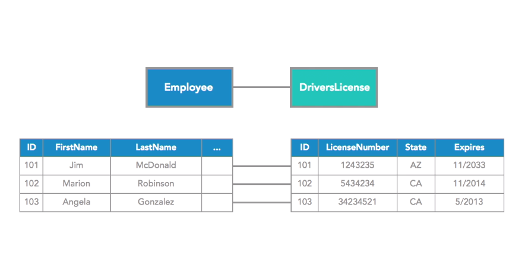
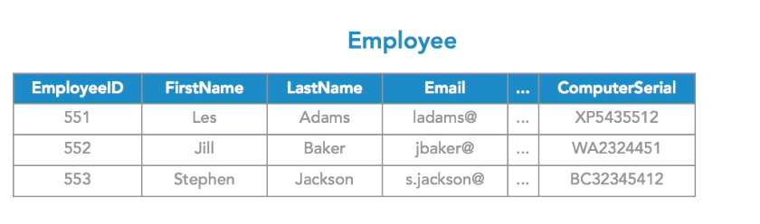
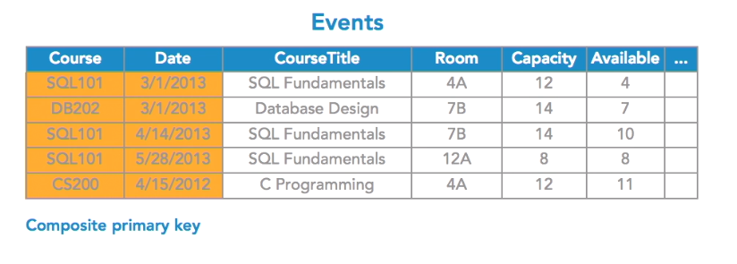

# Part 1: Understanding Databases
## What are Databases?

1.  Size – Scalable 
2.	Ease of updating – Accessible 
3.	Accuracy – Accurate 
4.	Security – Secure 
5.	Redundancy – Consistent 
6.	Importance – Permanent 
Database give us structure.

## Exploring Databases and Database Management Systems?

1. Example DBMS : Oracle, SQL Server, My SQL, Postgre SQL, MongoDB

2. DBMS Software
   
* DBMS software like Oracle or DB2 not installed on personal machine but on a separate server.
* Use that DBMS software to create or manage one or more databases.
* Database is your data and your rules about that data.
* Company can have multiple databases or DBMS management systems.

3. Relational DBMS
* Are the most widely used 
* Use the same principal across all offerings.
* Are foundational for understanding other systems

# Part2: Database Fundamentals
## The feature of relational Database

* A table is most fundamental building block of a
  database

1. A database without table is an empty sheel, devoid of meaning

   

   A <b>key</b> is a  way to identify just one particular row in any table and it's created typically as one column that will contain a guaranteed unique value for each row. 

    

   * Each column describes one piece of data
   * It also says what type of the data must be\
   * DBMS system will not let us break them
   * Tables and columns are defined up front
   * Day-to-day use is in creating and updating rows

   

## Unique Values and Primary Keys

* Each column describes one piece of data

* It also says what type of the data must be

* DBMS system will not let us break them

* Tables and columns are defined up front

* Day-to-day use is in creating and updating rows

## Defining Table Relationships

Example:

* Customer ID : automatically generate a unique number

Each order is an order for a particular customer, to process an order, you would need to know who this applies to.

We could to above. But, don't. Why

* Duplication of Data

* No need to do this

  

'

* formal relationship between tables
* In order table, the customer ID does not have to be unique
* customer ID is foreign key

* start at customer row and then take that Customer ID and go get every order for that customer
* go from the order row and find Customer ID  and then find out which customer is associated with that particular order
* one-to-many relationship
* one customer can have many orders

* crow's foot symbol

* one-to-infinity symbol 

## Describing many-to-many relationships

* no obvious to spot

* you cannot express many-to-many relationships directly

Example:

* **Bad** Repeating Group or Repeating Column

* **Bad** Discourage as well

* not unique in the junction table 

One-to-one relationships is possible but why don't just combine them?

## Transaction and the ACID Test

**Transaction** is a combine unit of work 

* both of these happens or neither of them
* first part of the transaction failed if any part of the transactions failed

* **Atomic** : must have happened or not at all
* **Consistent** : Any transaction must take the database from one valid state to another valid state based on the rules of the database
* **Isolated**: No other transactions are allowed until the transaction have finished
* **Durable**: Robust eg. power failure shouldn't be an issue after your transaction is made

## Introduction to Structured Query Language (SQL)

**SQL** is used to describe what you want and you let the database management system handle how that's actually done. You just describe the outcome.

# Part3: Database Modeling: Tables

## Introduction to database modeling

* agile
* planning

## Planning your database 

* Identify what entities we naturally have

* In relational databases, we only concern about what data need to be saved.
* Entity modeling (ER modeling)

## Identifying Columns and selecting data types

* Specify what data is store in each entity. In entity relationship, these are referred to as our **attributes**

  

  

* go very granular, as individual as possible
* don't use space

* MySQL have different types of int (Go to dev.msql.com)

  

  

* Fixed Length (if more than the fixed length, extras character will be terminated)
* Unicode (For foreign language)

* Binary data

* Binary Large Objects (BLOBS)

* Character Large Objects (CLOBS)

  

* Sometimes you don't required a value

* NULL is complete absence of a value

* not NULL, a value is required

  

## Choosing Primary Keys

* Each table should have primary keys, a value that uniquely identifies an individual where there can be no duplicated and no confusion

* Natural Key (e.g. ISBN)

  

* Add a CustomerID column and then make it automatically increment

## Using composite keys

* **Composite Key** is when one value does not uniquely identify a row, but two values do, we'd combine tow columns values to create unique primary key

* Useful when joining tables together (many-to-many relationships)

# Part4: Database Modeling Relationships

## Creating relationships

We need to say what these relationships are.

## Defining One-to-Many Relationships

* Refer to one and only one row in the customer table
* One customer can have many orders, but one order cannot have many customers

* In some cases, we can't use the same name for Foreign Key because there will be a conflict

## Exploring One-to-One Relationships

* Might as well just combine them

* always look at relationship on both ways when you thought you have found both way

## Exploring many-to-many relationships

* We don't need primary key for ClassStudent

## Understanding Relationships Rules and Referential Integrity

* Add a new order with a customer ID 388 but there's no customer ID 388
* The database is no longer valid, it would not be internally consistent. **Referential Constraint**
* Must add customer first!!!

* Updates will not work as well

* Any associate row will be deleted. Delete 367 will delete Order 101 and 102

  

* refuse the delete

# Part5: Database Modeling Optimization

## Understanding Normailization

* Database Normalization

## First Normal Form

Each of your columns and each of your tables should contain one value, just one value and there should be no repeating groups.

Violates First Normal Form

* inflexible design

## Second Normal Form

* Any non-key field ( the actual value in a particular column position for a particular row) should be dependent on the entire primary key

* **2NF is only a problem when we are using a composite primary key** (a primary key made of 2 or more columns) 
* Can I figure out any values in this row from just part of the composite key? No

What if someone only changes the Course but not the Course Title?

##  Third Normal Form

* No non-key field is dependent on any other non-key field

* Can I figure put any of the values in this row, from any of the other values in this row? Should not be able to do that!

  

* each room has a fixed number of seats

  

* Total is dependent on the other two non-key fields
* Remove the **Total** column, we will figure it out

## Database Normalization

It can be easier to add repeating group rather than adding multiple tables. **Denormalization Decision**

Some zip codes may have multiple city, town or even states!

# Part6: Database Modeling (Querying)

## Creating SQL Queries

SQL does not care if Select is Uppercase or Lowercase

SQL not sensitive to line breaks, white space

How to know which table?

Making assumptions that we have a database called Human Resources

## Structuring the WHERE clause

* WHERE part that specifying a condition or predicate

  

Just single = 

 no need to quote if it is just value

wild card! 

Using likes can be inefficient!

Not a good choice to use = sign 

IS NULL

IS NOT NULL

## Sorting Query Results

Not finding this useful e.g. Find out the most expensive product that I have

By default, order is in **ascending order**

## Using Aggregate Functions

COUNT

MAX

MIN

SUM

It can either give you the single count of all rows, or it can give you all the multiple values in the color column

## Joining Tables

* To join our tables together

* Alice does not have a match --> Inner Join 
* JOIN is default to INNER JOIN

* OUTER JOIN --> something take precedance

## Inserting, updating, and deleting

## The data definition languages

People will use **MySQL Workbench** or **SQL Server Management Studio**

# Part7: Database Modeling: Indexing and Optimization

## Understanding indexes

* An index in the database is like an index in a textbook
* Primary key does not answer if it can help us to find the row really fast
* Primary index on any table is called **Clustered Index**
* Most of the DBMS will automatically make the primary key the clustered index
* Each table can only have one clustered index

Full Table Scan very inefficient way to get to your data

## Understanding write conflicts

Race Condition

dirty read

## Understanding stored procedures and injection attacks

Stored Procedures/ SProc

Use Stored Procedures with  parameter rather then constructing your own strings

# Part8: Database Options

## Desktop databases

* Microsoft Access, FileMaker Pro Advanced, Apache OpenOffice

## Relational databases management

* Mircrosoft Azure and Amazon Web Service you can pay them and then you build the infrastructure
* Express edition is free (DB2 Express-C, SQL Server Expres)

## XML and Object-Oriented Databases

* XML documents use the nested tree structure of XML 
* Use XML languages (Xquery) to query data rather than using SQL

* User ORM to map objects in an object-oriented language to regular relational database tables

## NoSQL Database Systems (Not only SQL)

* Skills in each db is not transferable

